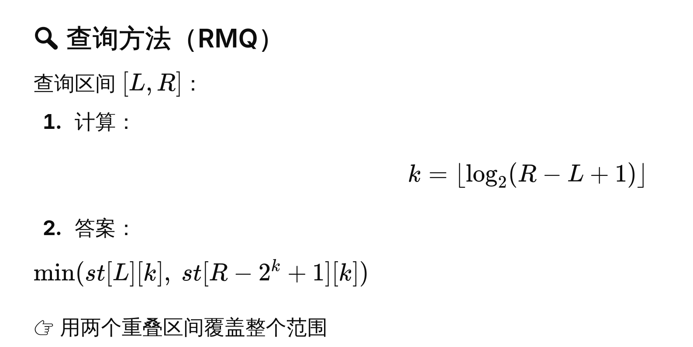

# 稀疏表

sparse table, st table

常见问题，给定数组nums, 多次查询[L,R], 返回[L,R] 区间内的最小值

这个问题也叫做RMQ (Range Minimum Query)


其他问题包括GCD等问题


比如

nums = [1,3,2,,7,9,11]

query(1,4) => 2

query(0,5) => 1


稀疏表预处理

定义`st[i][k]`： 从i开始，长度为2^k 的区间的最小值，则可以推出

`st[i][k] = min(st[i][k-1], st[i+2^(k-1)][k-1])`

对于每次查询，返回




```go
package main

import "fmt"

type SparseTable struct {
	log2 []int
	nums []int
	st   [][]int
}

func NewSparseTable(nums []int) *SparseTable {
	log2 := make([]int, len(nums))

	for i := 2; i < len(nums); i++ {
		log2[i] = log2[i/2] + 1
	}
	max_k := log2[len(nums)-1]

	// init st
	st := make([][]int, len(nums))
	for i := 0; i < len(nums); i++ {
		st[i] = make([]int, max_k+1)
		st[i][0] = nums[i]
	}

	// construct st
    // 注意这里 i + (1 << k) <= len(nums)， 实际是在控制区间长度需要
    // i + 2^k - 1 < n
	for k := 1; k <= max_k; k++ {
		for i := 0; i+(1<<k) <= len(nums); i++ {
			st[i][k] = min(st[i][k-1], st[i+(1<<(k-1))][k-1])
		}

	}

	return &SparseTable{
		log2: log2,
		nums: nums,
		st:   st,
	}

}

func (st *SparseTable) query(L, R int) int {
	k := st.log2[R-L+1]
	return min(st.st[L][k], st.st[R-(1<<k)+1][k])

}

func main() {
	nums := []int{1, 3, 2, 7, 9, 11}
	st := NewSparseTable(nums)
	fmt.Println(st.query(3, 5))

}

```

