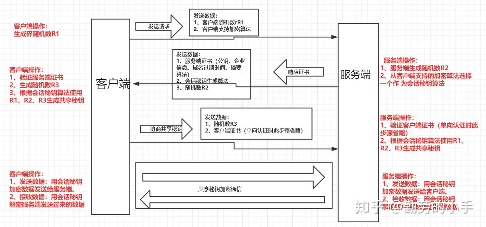

## Database

事务ACID

原子性

一致性， 事务前后数据库都满足完整性约束

隔离性 isolation

持久性 durability


如果不设置事务

- 可能table 1 changed，但table 2 unchanged, 造成问题
- race condition, 查询时两线程都发现库存 = 1, 因此两次操作，导致库存更新为-1
- 执行了一半，发现问题了，但无法回滚，只能自己手动补偿，但很易错


事务并发可能的问题：

- 更新丢失：两个tx, 后tx覆盖先tx的结果

- 脏读：一个tx读了另一个tx未提交的数据， tx1修改数据，tx2读取数据，此时tx1未结束但数据已被修改，此时tx1回滚，导致tx2读的数据和数据库的数据不一致

- 不可重复读：one tx读两次相同数据，结果不一致，因为后tx进行了更新操作

- 幻象读（phantom read）


参考完整性 reference integrity

索引创建在

- 经常需要搜索的列
- 作为主键的列
- 常用于join的列（foreign key）
- 常需要范围搜索的列 （如block num）
- 常需要排序的列，加快排序
- 常用于where的列
- 


## HTTPS (SSL/TLS)

SSL: Secure Sockets Layer

TLS: Transport Layer Security


Client symmetric key X)

Server (private key A, public key A, 

对X进行非加密传输后，Client Server都知道X的信息，之后的内容都用X加密进行传输

Client -> request -> server	

Server -> public key A -> client

client -> pubA(X) -> server

server  decrypt, get X


需要认证公钥A是CA认证的（数字证书），才能防止man in the middle attack,因为middle man可以欺骗伪造其自己的公钥和私钥


但是数字证书也可能被篡改，因此需要digital signature = privateCA(hash(plain text))

digital certificate = 明文 + 数字签名， 用数字签名验证明文hash是否与数字签名解密后的hash一致

浏览器保有CA的公钥



整体流程

1. Client向server发送https请求
2. server向client发送数字证书（公钥，企业信息等）
3. 客户端验证数字证书（用公钥解密并对比hash）
4. server生成会话密钥（symmetric key）
5. client server加密会话


| Layer       | Items                                                        | Unit                                |
| ----------- | ------------------------------------------------------------ | ----------------------------------- |
| Application |                                                              | Message/Data                        |
| Transport   | 端口，网关，端到端                                           | segment段 - TCP；datagram数据报-UDP |
| Network     | IP, 路由器，ARP (Address Resolution Protocol translate from IP to MAC )， ICMP （用于ping） | packet包；数据报datagram            |
| Link        | MAC.  交换器， , LAN， CSMA/CD， MTU, Etherenet, WiFi        | Frame 帧                            |
| Physics     | 集线器hub,中继器repeater                                     | 比特bit                             |

路由器：NAT，访问控制，连接不同网络，寻址

router: 

- Distance Vector 距离矢量  （bellman ford）
  - RIP, BGP,IGRP

- Link State 链路状态 （dijkstra）

  - OSPF，IS-IS

  


选择重传：selective repeat protocols


## 交换变量

```
a = 5, b = 15
a = a + b
b = a - b
a = a - b


a = a * b
b = a / b
a = a / b

a = a ^ b
b = a ^ b
a = a ^ b

(a ^ a = 0, a ^ 0 = a)

```


## OSI

Open System Interconnection

application layer

presentation layer 表示层：不同终端的上层用户提供数据和信息正确的语法表示变换方法

session layer 会话层：opening, closing and managing a [session](https://en.wikipedia.org/wiki/Session_(computer_science)) between end-user application processes， 认证，权限

transport layer 


## What happens after you request sth

你在浏览器中访问 `http://example.com/index.html`

你的电脑 IP：`192.168.1.10`，源端口：`50000`

服务器 IP：`93.184.216.34`（example.com 真实 IP 之一），目的端口：`80`

MAC：

- 你的网卡 MAC：`AA:BB:CC:DD:EE:FF`
- 网关 MAC：`11:22:33:44:55:66`


**HTTP Payload**

```
GET /index.html HTTP/1.1\r\n
Host: example.com\r\n
User-Agent: curl/8.0\r\n
Accept: */*\r\n
\r\n
```

**TCP Segment: TCP header + [HTTP Payload]**

```
c3 50         # 源端口 0xC350 = 50000
00 50         # 目的端口 0x0050 = 80
00 00 00 01   # 序列号
00 00 00 00   # 确认号
50 18         # Data Offset=5, Flags=PSH+ACK
72 10         # 窗口大小
12 34         # 校验和
00 00         # 紧急指针
```

**IPv4 Packet: IP Header + [TCP Segment]**

```
45 00 00 7A   # 版本4+首部长度5，Total Length=0x007A
1c 46 40 00   # 标识与分片
40 06 a6 ec   # TTL=64, Protocol=6(TCP), Header Checksum
c0 a8 01 0a   # 源IP 192.168.1.10
5d b8 d8 22   # 目的IP 93.184.216.34
```

**WiFi/Ethernet Frame: Frame Header + IPv4 Packet**

```
08 01              # Frame Control: Type=Data, Subtype=Data, ToDS=1
00 00              # Duration
11 22 33 44 55 66  # Addr1: 接入点(AP)MAC — 接收方
aa bb cc dd ee ff  # Addr2: 你的设备MAC — 发送方
11 22 33 44 55 66  # Addr3: BSSID/路由器MAC
10 86              # Sequence Control
AA AA 03 00 00 00  # LLC/SNAP Header
08 00              # EtherType = IPv4
...                # 这里是整个 IPv4 包 (包含TCP+HTTP数据)
f1 e2 d3 c4        # Frame Check Sequence (CRC-32)
```


```
┌─Ethernet Header (Dst MAC | Src MAC | 0x0800)
│   ┌─IPv4 Header (src 192.168.1.10 | dst 93.184.216.34 | proto 6)
│   │   ┌─TCP Header (src port 50000 | dst port 80)
│   │   │   └─HTTP Request Payload ("GET /index.html ...")
│   │   └─TCP Options/Flags
│   └─IP checksum
└─Ethernet FCS
```


## GRPC


gRPC server: grpc server port

gRPB stub: grpc client port


proto buf:数据描述语言

数据构造称为 message


grpc四种服务提供方法

- Unary RPC， 

```protobuf
rpc SayHello(HelloRequest) returns (HelloResponse);
```

- server streaming rpc

客户端向服务器请求，客户端从流中一直读取返回信息

```
rpc LotsOfReplies(HelloRequest) returns (stream HelloResponse);
```

- client streaming rpc

客户端写入一系列信息到服务器，返回服务器的响应

```
rpc LotsOfGreetings(stream HelloRequest) returns (HelloResponse);
```

- bidirectional streaming rpc

两个流独立，可以交替读取消息然后写入消息

```protobuf
rpc BidiHello(stream HelloRequest) returns (stream HelloResponse)
```

基于http2

通道 channel，RPC， 消息 message

metadata + channel


protobuf type: 

double, float, int32, int64, uint32, uint64, sint32, sint64, fixed32, fixed64, sfixed32, sfixed64, bool, string, bytes

field number: 1 到536,870,911的值，不应该被重用，低field number的应该占更少空间


protobuf wire format：


## ICMP(ping/traceroute)

ping， traceroute, both use ICMP protocol  (**Internet Control Message Protocol**)


ICMP

当网络层有问题，两个设备无法连接时，可以用ICMP用来诊断

TCP: connection-oriented，通过handshake建立连接，但 ICMP: connectionless protocol，不需要建立连接


**Packet: IP Header + [ICMP datagram]**

 ICMP datagram as follows: 

| 8 bit | 8 bit | 16 bit   | 32 bit          | variable length |
| ----- | ----- | -------- | --------------- | --------------- |
| Type  | Code  | CheckSum | Extended Header | Data/Payload    |


## ML DL

check notion

